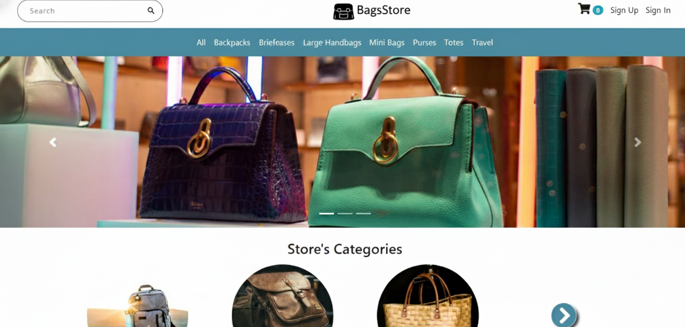

# 🛒 BagsStore - A Simple E-Commerce Store

A full-stack **E-Commerce Web Application** built using **HTML, CSS, JavaScript** for the frontend and **Node.js with Express.js** for the backend.  
This project is created as part of the **CodeAlpha Full Stack Development Internship**.

---

## 📌 Project Overview

This application allows users to browse products, add them to a shopping cart, place orders, and manage accounts.  
All data is stored in a database and handled securely through a backend server.

---

## 🚀 Features

### 👤 User System
- User Registration
- User Login
- Session-based Authentication

### 🛍️ Shopping Features
- View product listings
- Product details page
- Add products to cart
- Update cart quantity
- Remove products from cart

### 📦 Order Processing
- Checkout system
- Place orders
- Store order history

### 🛠️ Admin Features
- Add new products
- Edit products
- Delete products
- View customer orders

---

## 🖥️ Tech Stack

### Frontend
- HTML
- CSS
- JavaScript

### Backend
- Node.js
- Express.js

### Database
- MongoDB (using Mongoose)

---

## 📂 Project Structure

```
CODEALPHA_SIMPLE_ECOMMERCE
├── components
├── config
├── middleware
├── models
├── public
├── routes
├── seedDB
├── views
│
├── app.js
├── package.json
├── README.md
└── screenshot.png
```

---

## 🗄️ Database

The project uses **MongoDB** to store:
- Users
- Products
- Shopping cart data
- Orders  

Mongoose is used to manage schemas and database operations.

---

## 🔐 Authentication

- Secure login system  
- Password encryption  
- Protected routes using middleware  

Only logged-in users can access cart and order features.

---

## 🎯 Internship Task Fulfillment

This project fulfills **Task 1: Simple E-commerce Store** of CodeAlpha:

- ✔ Product listings  
- ✔ Shopping cart  
- ✔ Product details page  
- ✔ Order processing  
- ✔ User registration & login  
- ✔ Database integration  

---

## 📸 Screenshot



---

## 🧑‍💻 Developer

**Name:** Nagaraj Naik  
**Internship:** CodeAlpha Full Stack Development  
**Task:** Simple E-Commerce Store  

---

## 📜 License

This project is created for educational and internship purposes.
